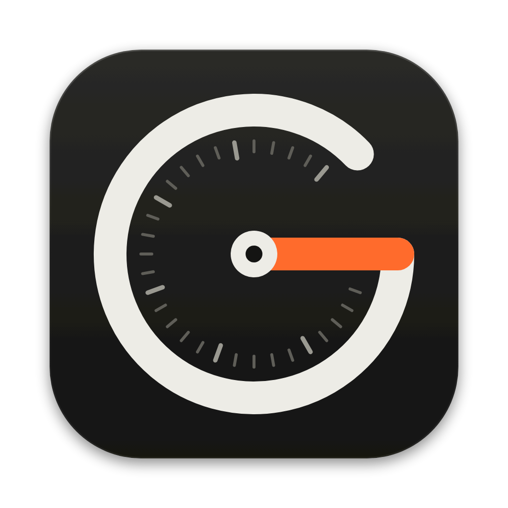
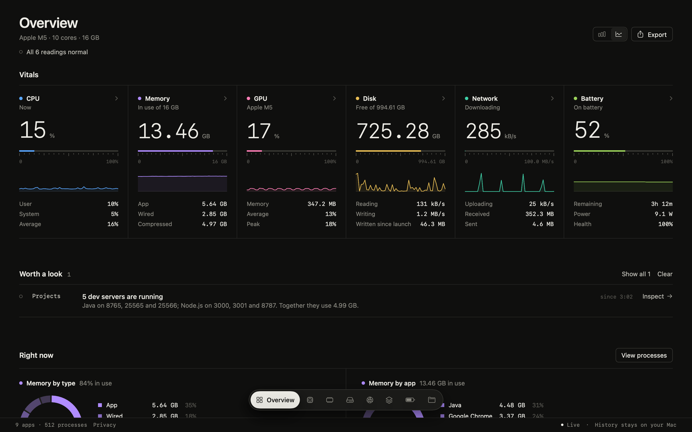
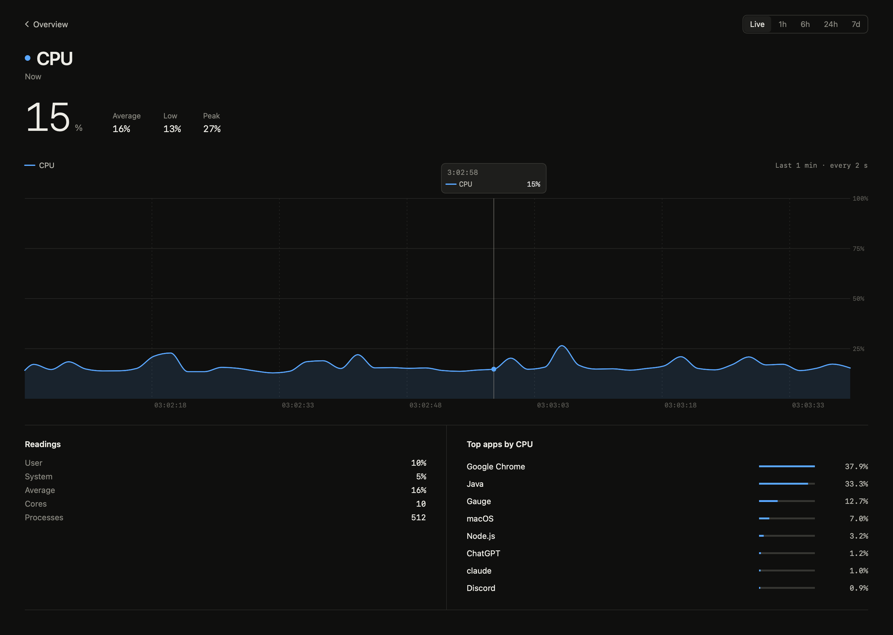
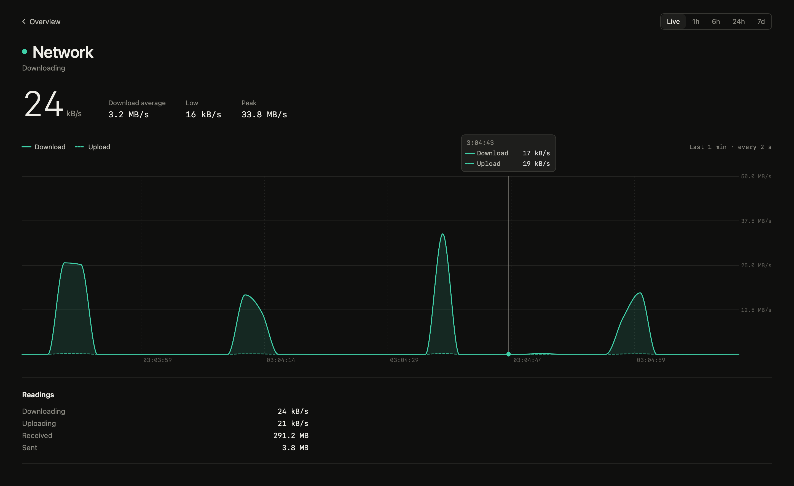
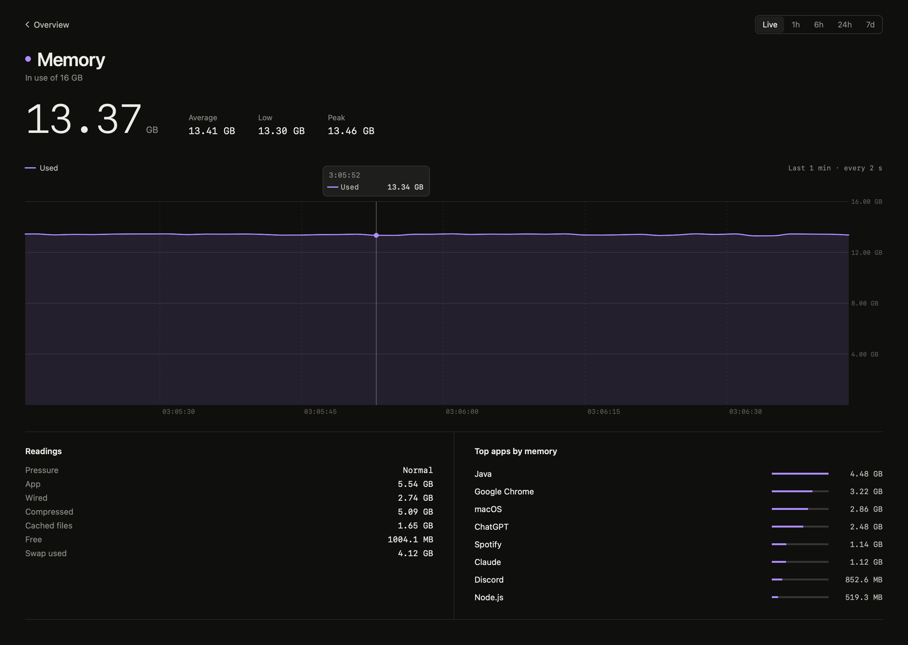
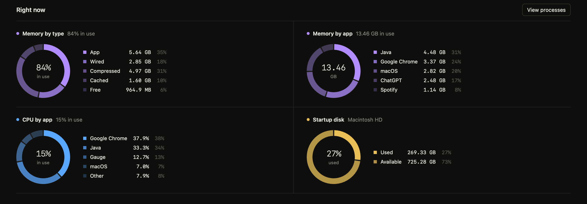
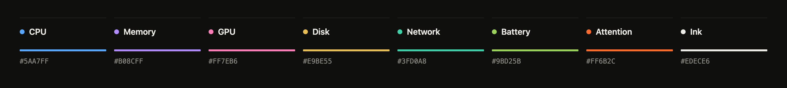

<div align="center">



# Gauge

**A precise, private system monitor for macOS.**<br>
Native SwiftUI. Live readings. History stays on your Mac.

[](#build-from-source)
[](https://swift.org)
[](app/Sources/Gauge)
[](#history-stays-on-your-mac)
[](#history-stays-on-your-mac)
[](LICENSE)

[Features](#features) · [Screenshots](#a-closer-look) · [What it measures](#what-it-measures) · [Privacy](#history-stays-on-your-mac) · [Build](#build-from-source) · [Roadmap](#roadmap)

<br>



<sub>Real readings from a MacBook Air (Apple M5), rendered by the app's own SwiftUI views.</sub>

</div>

<br>

## Features

Gauge is built like a measuring instrument rather than a dashboard: six vitals sit side by side like channels on a mixing desk, each with its own colour, a monospaced readout, a tick-mark scale and a fine trace.

- **Six live vitals, every 2 seconds.** CPU, memory and memory pressure, GPU, disk space and throughput, network, and battery.
- **A page for every metric.** Click a channel for a large chart with ranges from Live to 7 days, plus average, low and peak, full readings and the top apps.
- **Hover for exact values.** A crosshair follows the pointer and reads out the time and every series at that moment.
- **Worth a look.** Plain-language notices when something needs attention, such as elevated memory pressure, an app pinning a core, a nearly full disk, or dev servers left running.
- **Right now.** Ring breakdowns of memory by type, memory by app, CPU by app and the startup disk.
- **Apps, not processes.** Helper processes are grouped under their app, so "Google Chrome" is one row, not forty.
- **Dev-server aware.** Spots Node, Python, Ruby, Bun, Deno and other local servers listening on TCP ports, with the folder each one runs in.
- **One signal colour.** Orange is reserved for readings that need attention, so a warning never hides among the metric colours.
- **Feels native.** Floating navigation island, ⌘1–⌘8 shortcuts, Esc to go back, sortable process table, Settings window, and CSV export.

## A closer look

<table>
  <tr>
    <td width="50%"></td>
    <td width="50%"></td>
  </tr>
  <tr>
    <td align="center"><sub><b>CPU</b> · live chart with hover readout and top apps</sub></td>
    <td align="center"><sub><b>Network</b> · download and upload on one chart</sub></td>
  </tr>
  <tr>
    <td width="50%"></td>
    <td width="50%"></td>
  </tr>
  <tr>
    <td align="center"><sub><b>Memory</b> · pressure, composition and top apps</sub></td>
    <td align="center"><sub><b>Right now</b> · ring breakdowns in each metric's colour</sub></td>
  </tr>
</table>

<sub>Hover readouts in these images are positioned by the renderer rather than a real pointer.</sub>

## What it measures

Everything comes from public macOS interfaces. Gauge needs no administrator access and installs no helpers.

| Reading | Source |
| :-- | :-- |
| CPU load, user and system | `host_processor_info` |
| Memory, composition, pressure, swap | `host_statistics64`, `sysctl` |
| GPU utilisation and memory | IOKit `IOAccelerator` performance statistics |
| Disk space, read and write throughput | Volume resource values, IOKit `IOBlockStorageDriver` |
| Network download and upload | `sysctl` 64-bit interface counters (Wi-Fi, Ethernet, cellular) |
| Battery charge, time, power and health | IOKit power sources and `AppleSmartBattery` |
| Per-app CPU and memory footprint | `libproc` |
| Local dev servers | `lsof` listening TCP sockets |
| Audio output and Bluetooth accessory batteries | CoreAudio, IOKit |

> [!NOTE]
> Temperature and fan sensors aren't read yet; they need a privileged helper. Processes owned by other users appear only in the memory total, as "Other & system".

## History stays on your Mac

- Readings are averaged every **10 seconds** into a SQLite file at `~/Library/Application Support/Gauge/history.sqlite`.
- Gauge **makes no network connections**. It has no analytics, no telemetry, no account and no sync.
- Choose how long history is kept (1 to 90 days), reveal the file in Finder, or **Clear History** from Settings (⌘,).
- Export what's on screen as CSV with **File › Export History** (⌘E).

## Design



Warm graphite and off-white, hairline rules instead of cards, and a flat colour for each metric that runs through its dot, scale, trace, rings and history line. Rings use tonal steps of the same colour. No gradients, glows or glass: colour carries meaning, and motion stays quick. Pages crossfade, readouts roll to new values, and scales glide.

The icon's dial arc draws a **G**, and the orange needle is its crossbar. Its source is [`app/Resources/AppIcon.svg`](app/Resources/AppIcon.svg).

## Build from source

**Requirements:** macOS 26 or later and Swift 6.2 (Xcode 26 or the Command Line Tools).

```bash
git clone https://github.com/byalex33/gauge.git
cd gauge/app
./build.sh --open
```

`build.sh` compiles a release build with Swift Package Manager, assembles `app/build/Gauge.app` with its icon, and signs it ad hoc for local use. There's no notarized download yet.

## Keyboard shortcuts

| Shortcut | Action |
| :-- | :-- |
| <kbd>⌘</kbd> <kbd>1</kbd> | Overview |
| <kbd>⌘</kbd> <kbd>2</kbd>–<kbd>7</kbd> | CPU, Memory, Disk, Network, GPU, Battery |
| <kbd>⌘</kbd> <kbd>8</kbd> | Projects (dev servers) |
| <kbd>Esc</kbd> | Back to Overview |
| <kbd>⌘</kbd> <kbd>E</kbd> | Export history as CSV |
| <kbd>⌘</kbd> <kbd>,</kbd> | Settings: history retention and Clear History |

## Project structure

```text
gauge/
├── app/                      Native macOS app (Swift Package)
│   ├── Sources/Gauge/
│   │   ├── Sampler.swift     Reads system counters (Mach, sysctl, IOKit, libproc, CoreAudio)
│   │   ├── Monitor.swift     Turns readings into vitals, notices and breakdowns
│   │   ├── HistoryStore.swift  Local SQLite history
│   │   ├── Detail.swift      Metric pages with interactive Swift Charts
│   │   ├── Sections.swift    Overview sections
│   │   └── …
│   ├── Resources/            Info.plist, AppIcon.svg / .icns
│   └── build.sh
├── prototype/index.html      Interactive HTML design prototype (sample data)
└── docs/                     README images
```

The HTML prototype is the design reference. Open [`prototype/index.html`](prototype/index.html) in a browser to explore the layout with sample data.

## Roadmap

- [x] Live CPU, memory, GPU, disk, network and battery
- [x] Per-app usage and dev-server detection
- [x] Interactive metric pages with saved history
- [x] Local-only history with retention controls
- [ ] Temperature and fan sensors via a privileged helper
- [ ] Menu bar extra
- [ ] Notarized release builds
- [ ] Desktop widgets

## License

[MIT](LICENSE) © 2026 Alex
